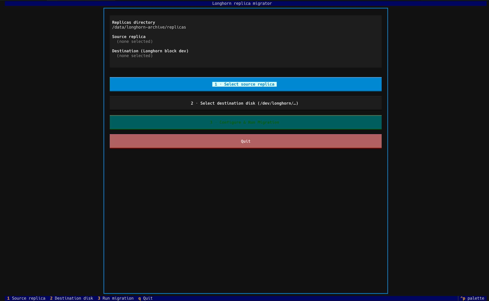
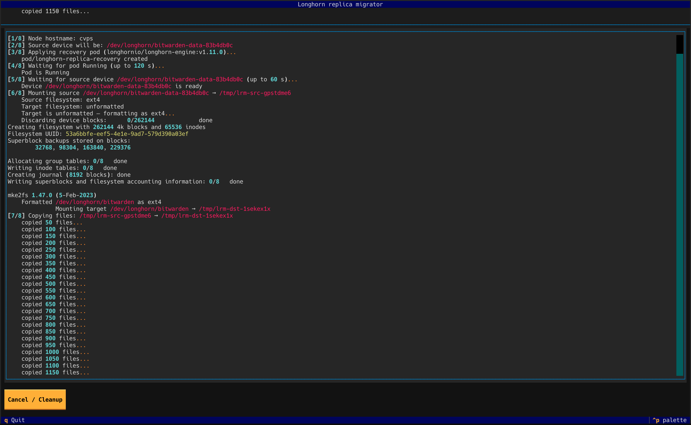
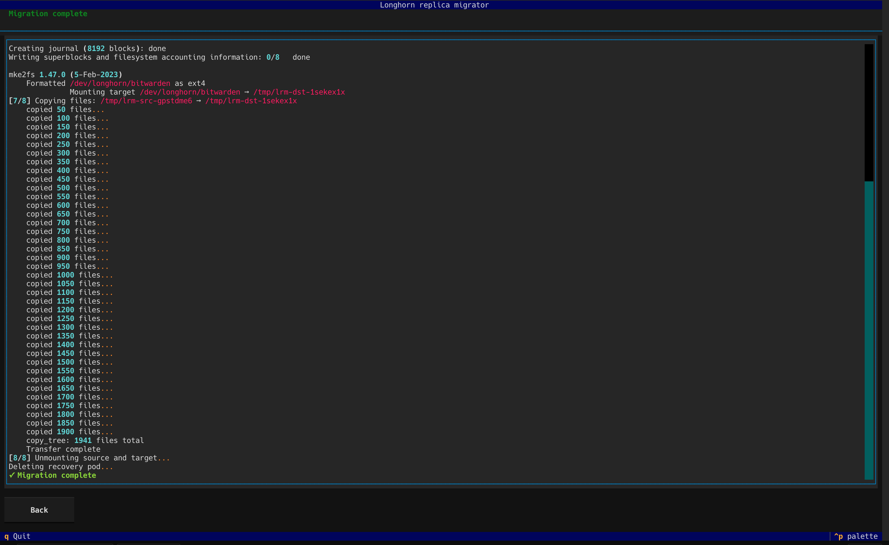

# Longhorn Replica Migrator

A terminal UI (TUI) for recovering data from orphaned Longhorn replica directories
and migrating that data into a new, pre-provisioned Longhorn volume.

Must be run **directly on the Longhorn storage node** with `kubectl` available and
configured to reach the cluster API server.  **The tool must be run as `root`** —
`mount`/`umount` require root privileges, and the Longhorn block devices under
`/dev/longhorn/` are typically only accessible to root.



---

## The space problem — and how this tool solves it

Migrating a Longhorn replica to a new volume on the **same physical disk** creates
an obvious problem: you need space for both the old data and the new copy
simultaneously.  A naïve copy of a 4 TiB replica requires 8 TiB free — which is
rarely available on a storage node that is already under pressure.

This tool solves it with **Move + Deflate** mode:

### Large-file chunked transfer

Individual files larger than 256 MiB are moved in **512 MiB reverse-order chunks**.
After each chunk is safely written and `fsync`'d to the destination, the
corresponding tail of the source file is removed via `ftruncate`.  At any point
during the transfer:

```
peak disk usage ≈ source_remaining + destination_written + 512 MiB chunk
                = total_data  (constant)
```

instead of `2 × total_data` with a standard copy.

### Periodic source deflation

Every 100 GiB transferred the tool **pauses, unmounts the source, and deflates it**:

1. Mounts the source block device briefly with `-o discard` and runs `fstrim`.
   This sends DISCARD/UNMAP commands to the Longhorn engine, which punches holes
   directly in the backing `.img` sparse files — freeing host disk blocks
   **without** a temporary space spike.
2. Measures `.img` block usage before and after `fstrim`.  If `fstrim` freed space
   (the common case), `fallocate --dig-holes` is **skipped** — the engine already
   punched the holes and scanning a multi-TiB sparse file for zeros would be a slow
   no-op.  `fallocate` only runs as a fallback when `fstrim` made no progress,
   meaning the engine zeroed blocks instead of holing them.
3. Remounts and resumes the transfer.

> **Why not `zerofree`?**  `zerofree` writes actual zeros to every free block on
> the filesystem.  Because Longhorn `.img` files are sparse, those free blocks are
> already stored as holes (zero host-disk cost).  Materialising them with zeros
> *increases* disk usage before `fallocate` can recover it — exactly the wrong
> direction on a disk that is nearly full.  `fstrim` + DISCARD lets the Longhorn
> engine punch holes directly, with no intermediate space spike.

### On-demand deflation

Button **4 · Deflate source replica** in the main menu runs the deflation cycle
independently at any time — useful for reclaiming space before starting a migration
or after an interrupted run.

---

## How it works

Longhorn stores replica data as raw files on the node's filesystem.  When a volume
is lost or corrupted but the replica directory survives, the data is still
recoverable.  This tool automates the two-mount recovery approach:

1. A **recovery pod** (`longhornio/longhorn-engine`) is scheduled on the same node
   with the orphaned replica directory mounted at `/volume`.  The pod runs
   `launch-simple-longhorn <volume-name> <size>`, which reconstructs the block
   device and exposes it at `/dev/longhorn/<volume-name>` on the host.

2. The tool then mounts both the **source** device (created by the recovery pod)
   and the **target** device (a new, empty Longhorn volume you pre-provision and
   attach to the node) to temporary directories.

3. All files are copied (or moved) from the source mountpoint to the target
   mountpoint.

4. Both mounts are released, the recovery pod is deleted, and — optionally — the
   original replica directory is removed.

The target Longhorn volume is a regular, healthy Longhorn PVC that Kubernetes
manages going forward.  After migration you can detach the volume and use it from
any workload.

---

## Prerequisites

| Requirement | Notes |
|-------------|-------|
| Longhorn storage node | The node where the orphaned replica directory lives |
| **Run as `root`** | Required — `mount`/`umount` and `/dev/longhorn/` access need root |
| `kubectl` configured | Must be able to schedule pods in the cluster |
| Python 3.11+ | `uv` is the recommended runtime manager |
| Target Longhorn volume | A new, **empty** Longhorn volume already attached to this node (see below) |

### Preparing the target volume

Before launching the migrator, create a new Longhorn volume via the Longhorn UI or
a PVC manifest and attach it to this specific node.  The volume must be:

- Empty (no existing data)
- Large enough to hold the source replica's data
- Attached and visible under `/dev/longhorn/<name>` on the node

---

## Installation

Modern Debian/Ubuntu systems block `pip install` into the system Python (PEP 668).
Use **`pipx`** — it creates an isolated virtualenv automatically and puts the
command on your `PATH`:

```bash
# Install pipx if not already present
apt install pipx
pipx ensurepath   # adds ~/.local/bin to PATH; re-login or source ~/.bashrc

# Build the wheel, then install
uv build
pipx install dist/longhorn_replica_migrator-*.whl

# Upgrade after a rebuild
pipx upgrade longhorn-replica-migrator
# or: pipx install --force dist/longhorn_replica_migrator-*.whl
```

### Alternative: manual virtualenv

```bash
python3 -m venv /opt/replica-migrator
/opt/replica-migrator/bin/pip install dist/longhorn_replica_migrator-*.whl
# run via full path:
/opt/replica-migrator/bin/longhorn-replica-migrator /var/lib/longhorn/replicas
```

### Run without installing (development)

```bash
uv run longhorn-replica-migrator /var/lib/longhorn/replicas
```

---

## Usage

```
longhorn-replica-migrator <replicas_dir> [--dev-root /dev/longhorn]
```

| Argument | Default | Description |
|----------|---------|-------------|
| `replicas_dir` | (required) | Directory containing Longhorn replica subdirectories, e.g. `/var/lib/longhorn/replicas` |
| `--dev-root` | `/dev/longhorn` | Directory where Longhorn exposes block devices |

Example:

```bash
longhorn-replica-migrator /var/lib/longhorn/replicas
```

---

## TUI walkthrough

### Step 1 — Select source replica

Press **1 · Select source replica**.  A table lists every subdirectory found under
`replicas_dir` along with its size, volume name, and metadata notes.  Navigate with
arrow keys, press **Enter** to confirm, or **Esc** to cancel.

### Step 2 — Select destination disk

Press **2 · Select destination disk (/dev/longhorn/…)**.  A table lists every entry
found under `--dev-root`.  Select the **target** volume — the new, empty Longhorn
volume you attached to this node.  Press **Enter** to confirm.

Once both selections are made, button **3** becomes active.

### Step 3 — Configure and run

Press **3 · Configure & Run Migration**.  A modal form appears:

| Field | Default | Description |
|-------|---------|-------------|
| Node hostname | auto-detected | Used as `kubernetes.io/hostname` node selector |
| Longhorn engine image | `longhornio/longhorn-engine:v1.10.0` | Container image for the recovery pod |
| Transfer mode | Copy | Copy (safe), Move (destructive), or Move + Deflate (space-efficient) |
| Delete source replica dir | Off | Remove the replica directory after transfer |

Press **Run Migration →** to start.

The migration log streams in real time.  If the target device is unformatted, it is
automatically formatted with the same filesystem as the source before mounting.





---

## The 8 automated migration steps

| Step | Action |
|------|--------|
| pre | Verify `kubectl` is available |
| 1/8 | Log the node hostname |
| 2/8 | Derive the source device path (`/dev/longhorn/<volume-name>`) |
| 3/8 | Build and apply the recovery pod manifest |
| 4/8 | Wait up to 120 s for the pod to reach `Running` state |
| 5/8 | Wait up to 60 s for the source block device to appear |
| 6/8 | Mount source and target devices to temporary directories |
| 7/8 | Copy or move all files from source mountpoint to target mountpoint |
| 8/8 | Unmount both devices; delete the recovery pod |
| opt | (optional) Delete the original replica directory |

All progress is streamed to the log panel in real time.

---

## Transfer modes

| Mode | Safe? | Space needed | When to use |
|------|-------|-------------|-------------|
| **Copy** | Yes — source intact | 2 × data size | You have spare disk space and want a fallback |
| **Move** | No undo | 2 × data size peak | Sufficient free space, fastest completion |
| **Move + Deflate** | No undo | ≈ 1 × data size | Source and destination share the same physical disk |

### Copy (safe, default)

Files are copied with `shutil.copy2` (preserving metadata).  The original replica
directory is left intact.  Use this when you want a fallback.

### Move (destructive)

Files are moved one at a time.  Each moved file is immediately deleted from the
source, so disk usage trends down as the transfer progresses.  Peak usage is still
up to 2 × data size for a single large file being copied before its source is
removed.  **There is no undo.**

### Move + Deflate (space-efficient, recommended for tight disks)

Same as Move, but every 100 GiB the source is deflated via `fstrim` + DISCARD so
the Longhorn engine punches holes in the backing `.img` files.  Combined with
512 MiB chunked large-file moves, peak extra disk usage is kept to roughly one
chunk (512 MiB) above the already-transferred data.  See
[The space problem](#the-space-problem--and-how-this-tool-solves-it) above for the
full explanation.

---

## Terminal mouse support

The TUI supports mouse navigation.  **Keyboard navigation always works** and is the
recommended way to operate the tool over SSH:

| Key | Action |
|-----|--------|
| **Tab** / **Shift+Tab** | Move focus between buttons |
| **Enter** / **Space** | Activate the focused button |
| **↑ / ↓** | Navigate rows in the replica/disk table |
| **Enter** | Confirm selection in a table |
| **Esc** | Cancel / go back |
| **q** or **Ctrl+C** | Quit |

### Mouse clicks not working over SSH

If hover highlights work but button clicks do nothing, the most common cause is a
**terminal multiplexer** (tmux or screen) swallowing mouse button events.

**tmux fix** — add to `~/.tmux.conf` and reload:
```bash
set -g mouse on
```
```bash
tmux source ~/.tmux.conf
```

**screen** — start screen with `screen -m` or add `mousetrack on` to `~/.screenrc`.

If you are not using a multiplexer, the SSH client itself may not be forwarding SGR
mouse sequences (`?1006h`).  In that case use keyboard navigation — it is equivalent.

---

## Notes and warnings

- **The tool must be run as `root`.**  Both `mount`/`umount` and direct access to
  Longhorn block devices under `/dev/longhorn/` require root privileges.  Running
  as a non-root user will cause the migration to fail at the mount step.
- The target Longhorn volume **must** be attached to the **same node** before
  running the migrator.  The tool does not provision or attach volumes automatically.
- If the migration is interrupted mid-transfer, the target volume may contain
  partial data.  Inspect the log output to determine how many files were transferred.
- The recovery pod name is fixed as `longhorn-replica-recovery` in the `default`
  namespace.  If a pod with that name already exists from a previous run, the tool
  will delete it before proceeding.
